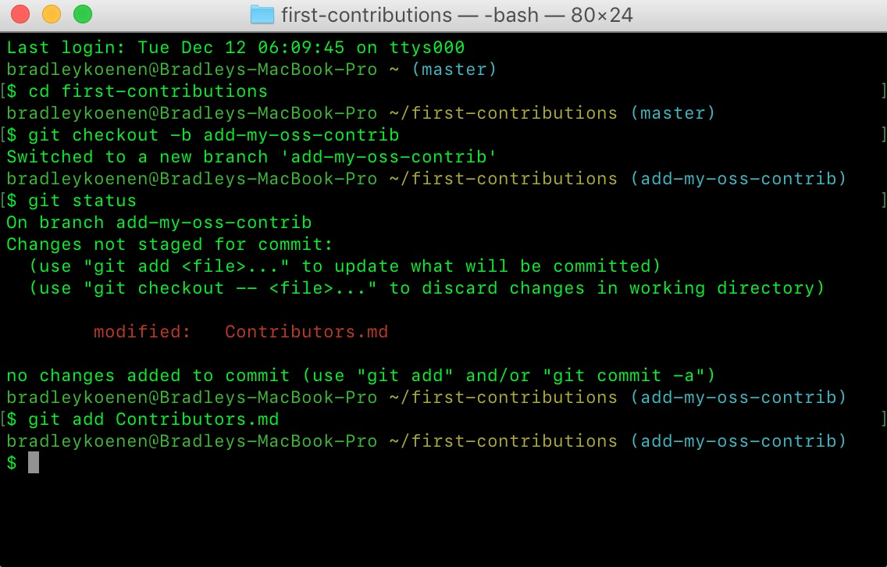
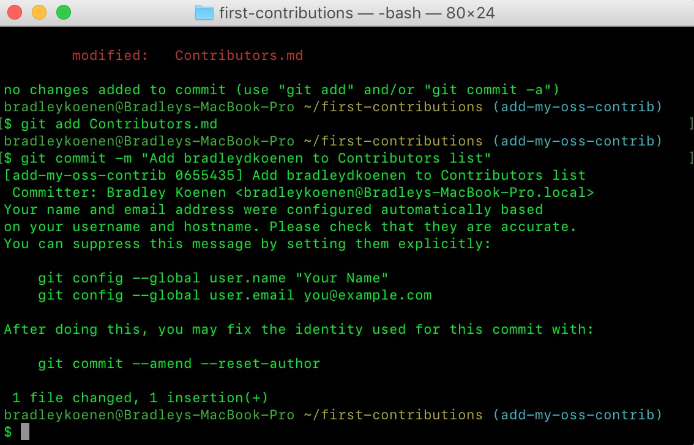
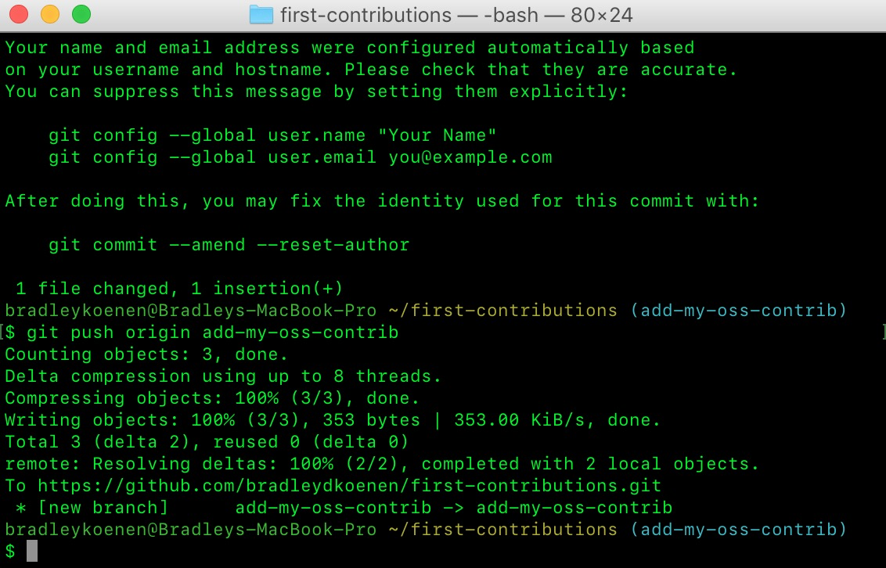
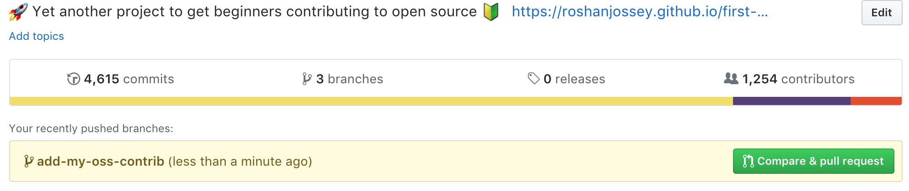
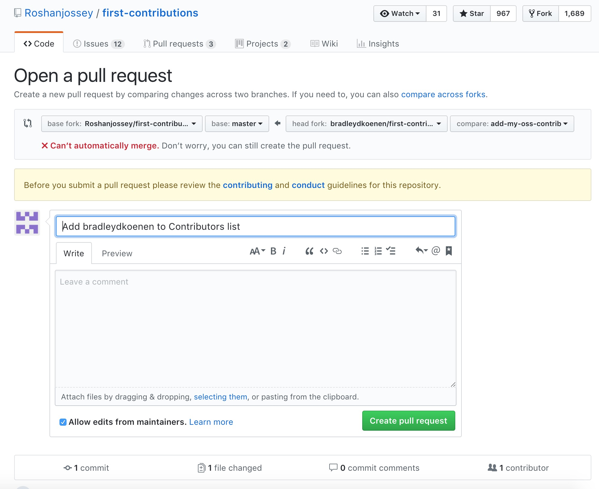

# my-oss-contrib
# Project 3: Contribute to an Open Source Project
###### Due 19 November 2017, 11:19 pm
###### Bradley Koenen
# First Contributions
# Link to finalized pull request: https://github.com/Roshanjossey/first-contributions/compare/master...bradleydkoenen:master
## 1.  Fork first-contributions repository

## 2.  Clone the repository

  - In terminal, run: git clone https://github.com/bradleydkoenen/first-contributions.git
  
  
## 3.  Create branch

  - In terminal, run: cd first-contributions
  
  
  - In terminal, create a new branch by running: git checkout -b add-my-oss-contrib
  
  
## 4.  Make necessary changes and commit those changes

  - First, I opened Contributors.md file in a text editor, added my name to it, and saved the file.
  
  
  - To verify change to Contributors.md, in terminal, run: git status
  
  
  - To add change to Contributors.md to the branch you created, in terminal run: git add Contributors.md
  
  
  - To commit change to Contributors.md, in terminal, run: git commit -m "Add bradleydkoenen to Contributors list"
  
  
## 5.  Push changes to GitHub

  - To push your changes, in terminal, run: git push origin add-my-oss-contrib
  
  
## 6.  Submit changes for review
  
  - In your repository on GitHub, select "Compare & pull request" button
  
 
  - Submit the pull request
  
 
  

