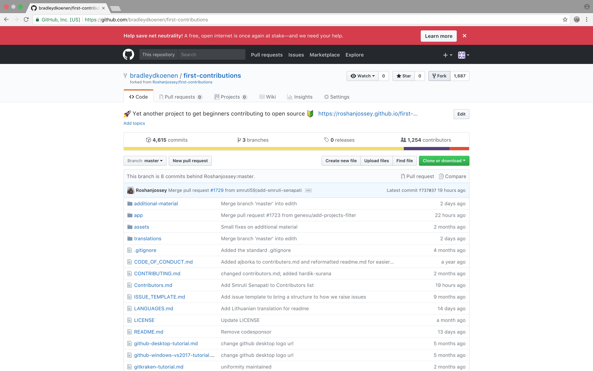
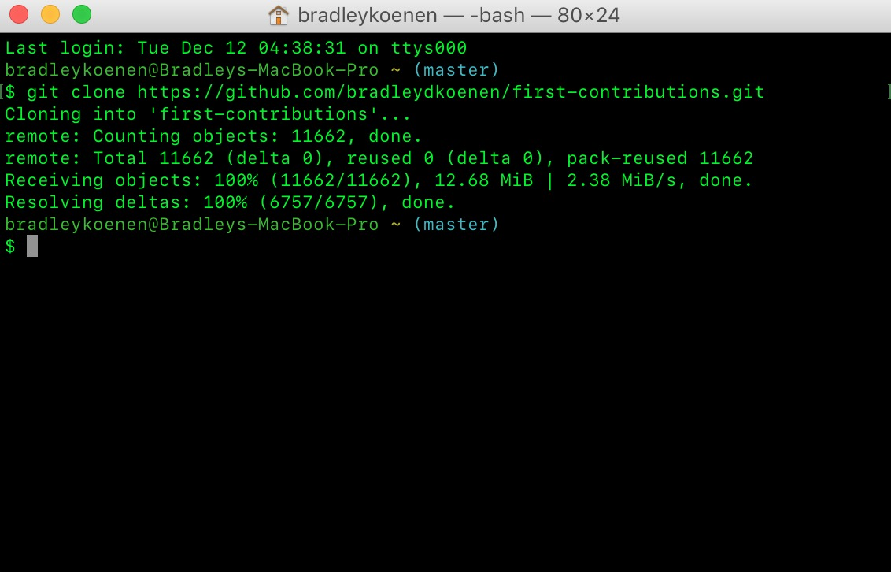
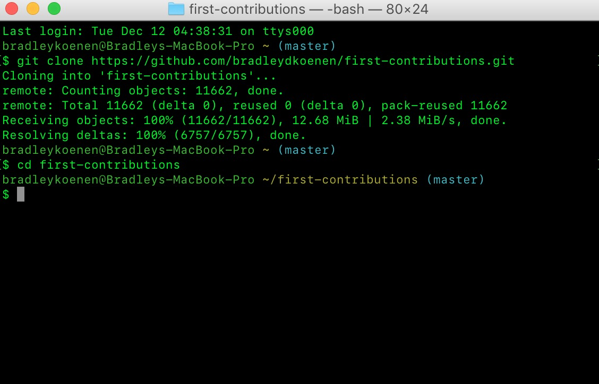
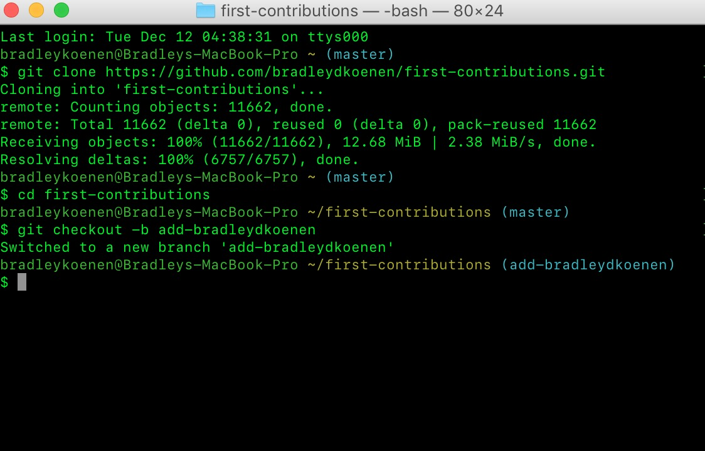

# my-oss-contrib

# Project 3: Contribute to an Open Source Project <h1>
###### Due 19 November 2017, 11:19 pm <h6>
###### Bradley Koenen <h6>

### ✅ Create a Github repo ("my-oss-contrib") to show your work in contributing to an open source project. <h3>
### ✅ Write up all your documentation in the README.md file of the repo, using Markdown. <h3>

## Steps: <h2>
1.  Go to <a href="https://github.com/collections/choosing-projects/" target="_blank">How to choose (and contribute to) your     first open source project</a>
2.  Find an open source project to which you'd like to contribute
3.  Follow the steps necessary to make a pull request
4.  Include the link to the pull request

## Grading: <h2>
## Justification: 20% <h2>
**Answering the following questions:**
- Why this project?
  * **I chose this project because it is one for beginners contributing to open source.**
- How active are the contributors on the project?
  * **The latest commit was on December 11, 2017, approx. 15 hours ago by Roshanjossey.**
  * **The project has 4,615 commits.**
  * **People commit daily**
- What do you think you can contribute?
  * **There are 12 active issues**
  * **Maintainers respond nearly daily when they are opened.**
  * **The most recent issue was opened one day ago.**
  * **30 issues have been closed so far, the most recent on Nov 6th.**
  
- What were your steps in choosing this project?
  
## Documentation: 40% <h2>
- Show your process from forking through editing/adding code all the way to the pull request. 
### - First, fork the first-contriution repository <h3>
  
  
### - Second, clone the first-contribution repository.  Click on the clone button and then click the copy to clipboard icon <h3>
  
  
### Open a terminal and run the following git command: <h3>
  git clone https://github.com/bradleydkoenen/first-contributions.git
  
  
### - Third, create a branch.  Change to the repository directory on your computer (if you are not already there): <h3>
  cd first-contributions
  
  
### Now create a branch using the git checkout command: <h3>
  *git checkout -b add-bradleydkoenen
  *
  
### Make necessary changes and commit those changes <h3>
  *Now open Contributors.md file in a text editor, add your name to it, and then save the file. If you go to the project    
  directory and execute the command git status, you'll see there are changes. Add those changes to the branch you just created 
  using the git add command:
  git add Contributors.md*
  
- Either a video screen capture with voice over screenshots with descriptions
- Examples of written documentation:
  * <a href="http://www.christianburk.com/csc548-2017/cab-process.pdf/" target="_blank">CAB process</a>
  * <a href="http://www.christianburk.com/csc548-2017/creighton-magazine-typo3.pdf/" target="_blank">Creighton Magazine Publishing</a>
  
Example of video screen capture with voiceover:

- http://codekarate.com/daily-dose-of-drupal/create-secret-urls-drupal-7-token-content-access
- <a href="https://www.youtube.com/watch?v=dSl_qnWO104/" target="_blank">Your First GitHub Pull Request (in 10 Mins)</a>

## Process: 20% <h2>
- How closely do you follow the steps and considerations described in How to choose (and contribute to) your first open source project

## Code change(s): 20% <h2>
- How did you improve the project with your code changes?
- What kind of improvements should the end user or the developers experience?
- Show the code changes and tell how it is an improvement.  
