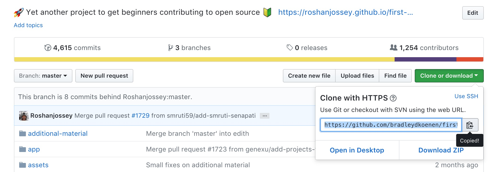

# my-oss-contrib
# Project 3: Contribute to an Open Source Project
###### Due 19 November 2017, 11:19 pm
###### Bradley Koenen
# First Contributions
## 1.  Fork first-contributions repository

## 2.  Clone the repository

  - In terminal, run: git clone https://github.com/bradleydkoenen/first-contributions.git
  
  
## 3.  Create branch

  - In terminal, run: cd first-contributions
  
  

