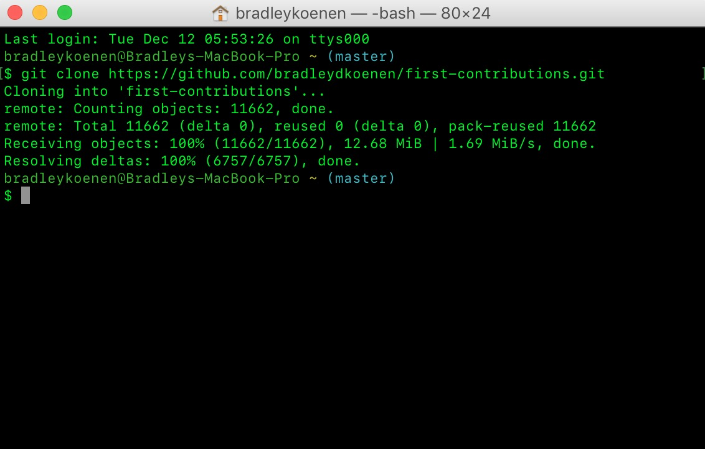

# my-oss-contrib
# Project 3: Contribute to an Open Source Project
###### Due 19 November 2017, 11:19 pm
###### Bradley Koenen
# First Contributions
## 1.  Fork first-contributions repository

## 2.  Clone the repository

  - In terminal, run: git clone https://github.com/bradleydkoenen/first-contributions.git
  
  
## 3.  Create branch

  - In terminal, run: cd first-contributions
  
  
  - In terminal, create a new branch by running: git checkout -b add-my-oss-contrib
  
  
## 4.  Make necessary changes and commit those changes

  - First, I opened the Contributors.md file in a text editor, added my name to it, and saved the file.
  
  
  - To verify changes, in terminal, run: git status
  
  
  If you go to the project directory and execute the command git status, you'll see there are changes. Add those changes to the branch you just created using the git add command: 
  

